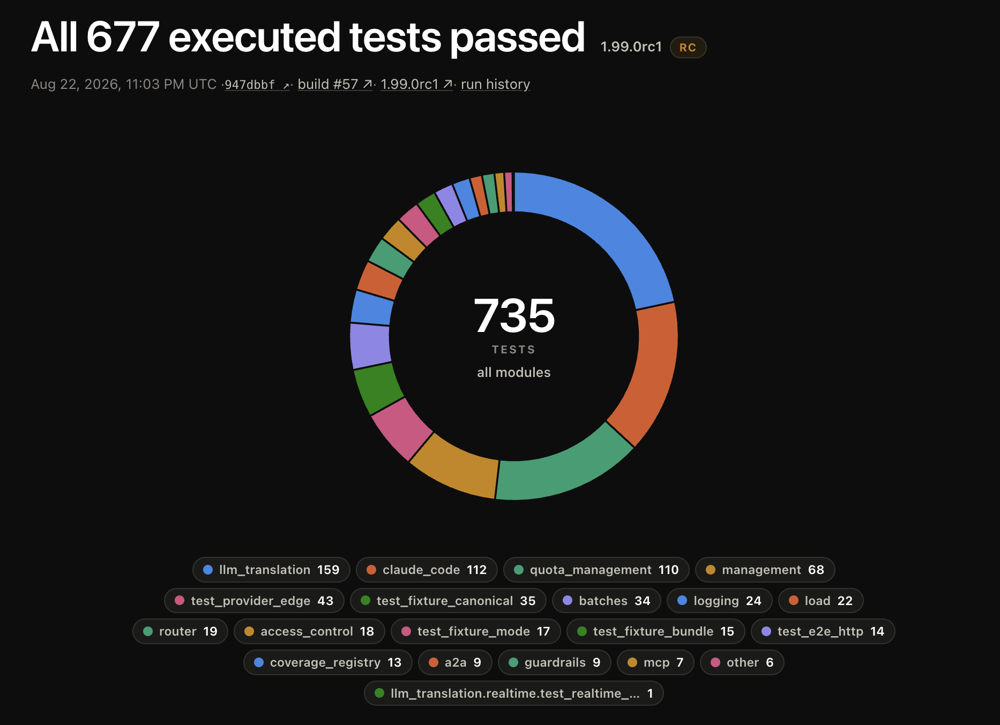
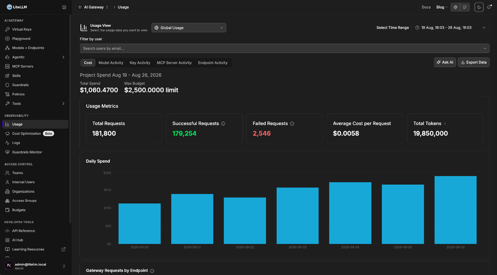
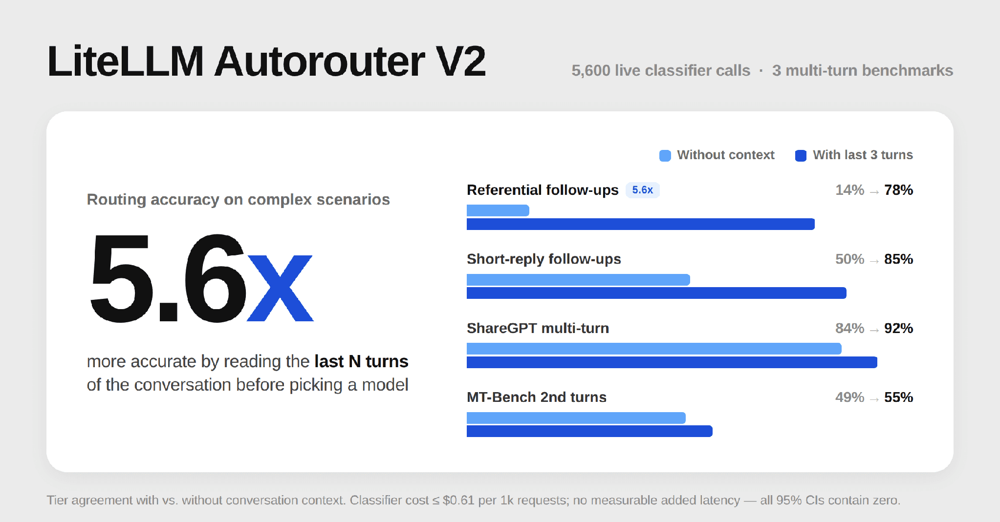
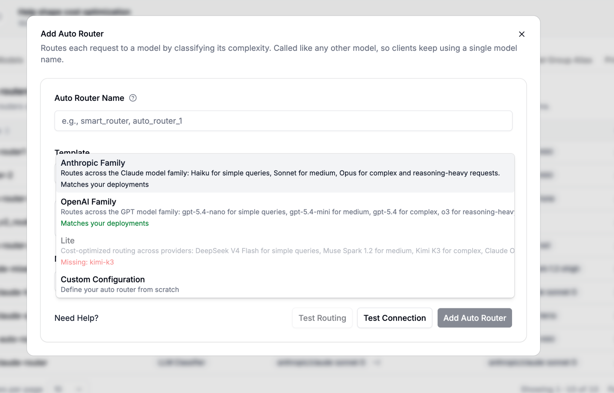
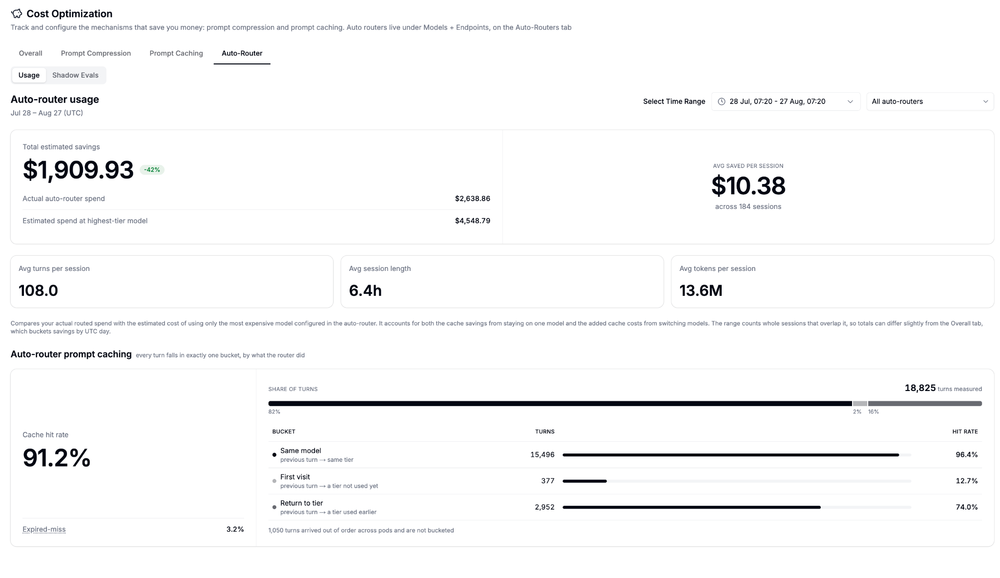
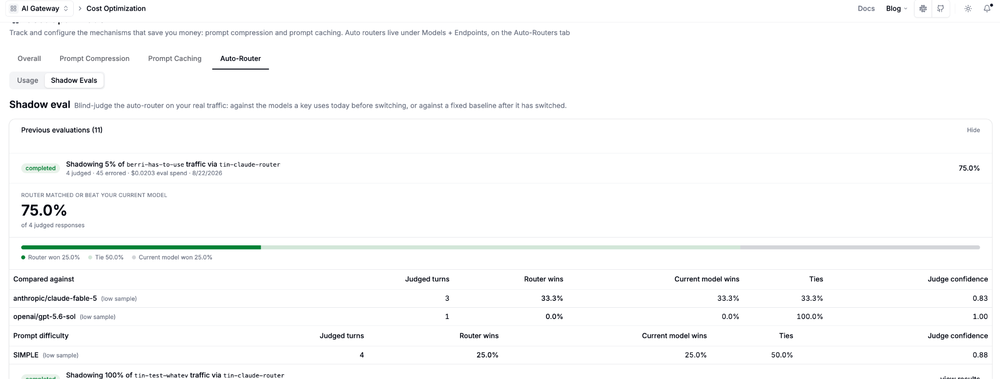

Thank you to everyone who joined our August town hall. We used it to share this month's security and stability work and our latest product updates: **79 security fixes**, **375 bug fixes**, and **142 feature commits**, a new Director of Security, a public status dashboard, and Auto-Router results from production.

{/* truncate */}

## Security

### 79 security fixes shipped this month

Here is where they landed:

| Category                                            | Fixes | Share |
| --------------------------------------------------- | ----- | ----- |
| Access control / authz hardening                     | 25    | 32%   |
| Credential / secret / PII hardening                  | 23    | 29%   |
| General hardening (unsafe outbound, UI role gating)  | 21    | 27%   |
| Quota / budget / rate-limit hardening                | 10    | 13%   |

We backport security fixes across the last four minor release lines. If you're on a version older than a month, upgrading to a newer version is recommended. The current release is v1.99.

We also announced that Oliver Jensen has joined as Director of Security; he was most recently CISO at Regrello.

### What's next for security

We're expanding the bug bounty program and hardening the recurring code patterns through the stability sprint.

## Stability

In August we shipped **375 bug fixes**.

| Area                          | Fixes |
| ----------------------------- | ----- |
| Other / SDK                   | 118   |
| Proxy Core & Resilience       | 88    |
| UI + Auth / SSO               | 66    |
| Cost, Budgets & Observability | 34    |
| Providers & Model Transforms  | 29    |
| Streaming / Realtime APIs     | 22    |
| MCP Gateway                   | 18    |

### status.litellm.ai is live

In an effort to increase transparency, we shipped a public dashboard to display what tests actually ran on the release. You can open any recent release and see which tests passed, drill into a specific area like quota management or Claude Code, and go through the full run history. For example, on the 1.98.0rc1 release, 104 Claude Code tests ran and all of them passed before it shipped.

Tracked live at [status.litellm.ai](https://status.litellm.ai/). If you have feedback on how we can improve transparency around releases, let us know.

### What kinds of fixes shipped

- **Cost tracking and budgets.** Spend logs capture every entry under load, budget resets land on schedule, and cost maps stay accurate as pricing changes roll in.
- **Batches API.** Multi-pod polling bills each batch exactly once, cost attribution on passthrough batches is correct, and malformed batch uploads get caught before they run.
- **MCP credential hygiene.** 18 MCP-scoped fixes. Tool calls run under each caller's own credentials, and OAuth sessions stay valid for the full length of a task.
- **AI gateway auth.** Billing and identity data stay in sync. Cost maps reflect current pricing, spend records persist through traffic spikes, and budgets enforce correctly at renewal and across multi-team splits.
- **Guardrail masking.** PII and PCI stay masked across spend logs, debug logs, and logging-only responses. Coverage spans every path data can take out of the system.

Spend tracking under heavy load was a large area of investment, and it will keep getting attention in the next months.

### The target: 80% E2E coverage in September

End-to-end coverage is at 70% across endpoints today. The goal for September is 80%, holding current velocity on bug fixes while we get there.

Most of that work is catching real customer use cases and getting them into the E2E suite. If there's a scenario you think our testing misses, feel free to let us know.

## Product

**142 feature commits** this month.

### Dark mode is here

Dark mode shipped on the dashboard. Choose dark, light, or follow your system setting.

The dashboard is now moved onto one shared component system. The navbar, playground, guardrails, usage, cost tracking, models and endpoints, team and user surfaces, the log details drawer, and the AI Hub, all migrated onto shadcn. 

Two engineers did this in under a month, alongside their stability work. The UI looks noticeably different from a month ago as a result.

### Day 0 model support in under an hour

Over the last month and a half we've brought time-to-release for a new model down from a day to under an hour.

- **Gemini 3.7 Flash** (Google) shipped in under an hour.
- **Grok 4.6** (xAI) on a similar timeline.

Both landed August 13, the day each provider launched, and shipped in the v1.98.0 stable release on August 22.

Developers ask for the newest model the day it lands, and we're pushing to make this under an hour. 

### Auto-Router: 51% cost savings in production

A design partner ran Auto-Router across 450+ users between April 15 and August 9, covering 272,876 requests and 7.08 billion tokens. Spend came in at $12,249 against a $23,985 all-flagship baseline, a 51.1% reduction, with no meaningful quality impact. Savings climbed from 42.9% in May to 60.7% in August as tier maps were tuned on real traffic. 95% of requests never needed the flagship tier.

### The classifier got smarter

Auto-Router now reads the last N turns of a conversation. That change produced a **5.6x improvement in routing accuracy** on referential follow-ups, at no measurable latency cost. It came directly out of community feedback.

### Auto-routing and prompt caching stack

The most common concern we heard was whether auto-routing would break prompt caching, since caching delivers real savings on its own.

It doesn't. The two stack. Router plus caching came in around 50% cheaper than caching alone in our benchmarks.

The reason is TTL. Prompt cache entries live at least five minutes, and when the router switches models as often as it does, you typically come back to a given model inside that window while its cache is still warm. The hit still lands. [Full writeup](https://docs.litellm.ai/blog/auto-router-prompt-caching-benchmark).

### AT&T cut AI costs 56%

AT&T reported a 56% cost reduction on coding and other advanced AI tasks after adopting LiteLLM model routing, with a 2% quality drop. Open-source models handle 40% of their employee queries today, and they plan to take that to 60-70%. Reported by [PYMNTS](https://www.pymnts.com/news/artificial-intelligence/2026/att-slashes-ai-costs-by-adopting-model-routers-and-open-source/).

### Auto-Router benchmarks

Four benchmarks published this month, each against its own baseline.

- **Claude Code coding tasks.** 40.4% lower cost at 97.1% of top-model quality.
- **RouterArena.** On a wider, independently graded prompt set, 74.5% lower cost at 87.3% quality.
- **Prompt caching.** Stacked with caching, the router beats caching alone by up to 69% on cost.
- **Terminal-Bench 2.0.** Matches the top model's solve rate on real agentic tasks at 27% lower cost.

### What else shipped on Auto-Router

- **1-click deploy templates.** Pick a model family instead of configuring tiers by hand. Choose Anthropic or OpenAI and the simple, medium, complex, and reasoning tiers come pre-populated. When a provider adds a new model, we update the configuration so you don't have to. Custom configuration is still there if you want it.

  

- **Auto-Router dashboard.** A usage tab under Cost Optimization showing savings per session, turns per session, session length, and cache-hit analytics. You can compare multiple auto-routers side by side.

  

- **Shadow evaluations.** The biggest blocker to adoption was wanting to see how the router would perform in production before rolling it out. Now you can sample a percentage of one key's traffic through a router, set a spend budget for the test, and pick your own judge model. In our run, the router matched or beat the current model on 75% of sessions.

  

### Try Auto-Router

- **Local CLI:** [docs.litellm.ai/docs/learn/autorouter_cli](https://docs.litellm.ai/docs/learn/autorouter_cli)
- **On proxy:** [docs.litellm.ai/docs/proxy/auto_routing](https://docs.litellm.ai/docs/proxy/auto_routing)
- **Join the discussion:** [GitHub Discussion #32168](https://github.com/BerriAI/litellm/discussions/32168), pinned in our repo. The community there is actively shaping the roadmap.

## Questions from the audience

**How are model prices updated, and where does the data come from?**
`model_prices_and_context_window.json` is the definitive source. We have automations that alert the team when a provider changes pricing. Where we pull each entry from varies, because providers publish this information in different places. When a provider like OpenAI announces a change, we update that provider, then check the other providers' own pages before propagating, so we don't show a discount on Azure that Azure hasn't actually applied.

**Is there a fair-share system if one user sends far more traffic than another?**
Yes. Dynamic request limiting supports thresholds and quotas per user today.

**SSO is free up to five users. Is that users sending requests, or users logging in?**
It's the number of user accounts created, counted as rows in the internal users table. One key making a large volume of requests doesn't count against it.

**Do you need an Auto-Router configured before running a shadow eval?**
Today, yes. Creating a router first is one extra step, and the model-family template makes it quick. Going straight from shadow eval to picking a family, skipping router creation, is a reasonable flow we haven't built yet. If you want to try it and give feedback, we'll pick it up.

**How is the cost reduction figure calculated?**
You pick a target model to benchmark against when you create the router. By default we use the most expensive model in your tier.

**Are you clearing the GitHub issue and PR backlog?**
The honest answer is that we need to resource open source better. We're hiring engineers dedicated to maintaining the repo, and expect to have more to share in the next two to three weeks.

## What's next

Thanks again for all the questions and feedback. We'll keep sharing concrete progress as this work ships, especially on the September coverage target.

We're also considering bringing customers onto future town halls to talk about their own setups. If that would be useful to you, let us know.

## We're hiring

LiteLLM is the open-source gateway thousands of teams use to run every model behind one API, from startups to the Fortune 500. We move fast: 142 features and 375 fixes shipped this month alone.

We're hiring across the core gateway, including on the security team Oliver is building out and on a dedicated open-source maintenance team. Small team, huge surface area, real ownership from day one. Want in, or know someone great? Reach us at [recruiting@berri.ai](mailto:recruiting@berri.ai).

Reach us at [support@berri.ai](mailto:support@berri.ai), or [product@berri.ai](mailto:product@berri.ai) for product feedback.

Thank you for using LiteLLM. **Krrish & Ishaan**
