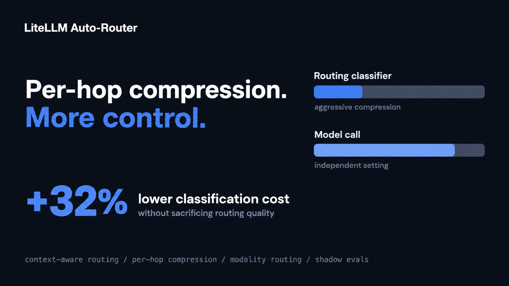
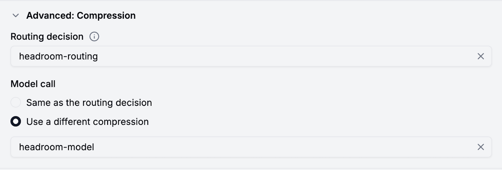

**The complexity router's LLM classifier can now be compressed more aggressively than your model calls. In internal testing, that cut classification costs a further 32% beyond what shared compression was already saving, with no change in routing accuracy.**

{/* truncate */}

:::info[🚀 Help shape the Auto-Router]

Get early access, work directly with the LiteLLM team, and influence the roadmap with your production traffic.

<a className="button button--primary button--lg" style={{background: '#2e8555', borderColor: '#2e8555', color: '#fff'}} href="https://calendar.app.google/i2e7qVEJphHi5S8UA">Apply to Become a Design Partner</a>

<br /><br />

Already testing it? Share your results in [discussion #32168](https://github.com/BerriAI/litellm/discussions/32168).

:::

## The problem

The complexity router can classify requests a few ways: a free heuristic scorer, keyword rules, or, when you need judgment the heuristics can't capture, an LLM classifier. That last option pays for a second LLM call on every request: one call to decide the tier (SIMPLE to a cheap model, MEDIUM to something in the middle, COMPLEX or REASONING to a frontier model), then a second call to the model that actually answers.

Until now, that classifier call shared its compression setting with the model call it routed to, which meant the classifier's compression was capped by whatever the model call could tolerate. That ceiling is the wrong one. The classifier only needs enough context to answer one question: what tier can handle this. It doesn't need the full conversation history or the detailed background the model call needs to actually produce an answer, so it can be compressed far past the point where the model call would start to suffer.

## The solution

Two new fields decouple the LLM classifier's compression from the model call's:

- `auto_router_routing_compression`: the guardrail to compress the classifier's prompt
- `auto_router_model_compression`: the guardrail to compress the model's prompt

Set the routing compression to be aggressive while the model call compression stays moderate. The same guardrail on both hops runs compression once, never twice. Either field can be `none` to skip compression for that hop.

## How it works

When you send a request through a complexity router with `classifier_type: llm` and separate compression settings:

1. The proxy applies the routing-hop compression to a copy of your messages
2. The classifier sees the compressed version and makes a routing decision
3. Your original messages get the model-hop compression applied
4. The routed model receives its own compressed copy
5. In the logs and API response, you see which compression guardrail ran for each hop

If both hops use the same guardrail, the proxy compresses once and reuses the result. If a compression guardrail is unreachable and set to `fail_closed`, the request fails safely.

## Setting it up

```yaml title="config.yaml"
model_list:
  - model_name: gpt-4o-mini
    litellm_params: {model: openai/gpt-4o-mini, api_key: os.environ/OPENAI_API_KEY}
  - model_name: gpt-4o
    litellm_params: {model: openai/gpt-4o, api_key: os.environ/OPENAI_API_KEY}
  - model_name: gpt-4-turbo
    litellm_params: {model: openai/gpt-4-turbo, api_key: os.environ/OPENAI_API_KEY}

  - model_name: smart-router
    litellm_params:
      model: auto_router/complexity_router
      complexity_router_config:
        tiers:
          SIMPLE: gpt-4o-mini
          MEDIUM: gpt-4o
          COMPLEX: gpt-4-turbo
        classifier_type: llm

        # Aggressive compression for the classifier
        auto_router_routing_compression: headroom-aggressive
        # Moderate compression for the model call
        auto_router_model_compression: headroom-moderate

guardrails:
  - guardrail_name: headroom-aggressive
    litellm_params:
      guardrail: headroom
      mode: pre_call
      api_base: https://api.berri.ai/headroom
      model: o1
      tokens_to_retain: 200

  - guardrail_name: headroom-moderate
    litellm_params:
      guardrail: headroom
      mode: pre_call
      api_base: https://api.berri.ai/headroom
      model: gpt-4o-mini
      tokens_to_retain: 1000
```

In the Admin UI, open a complexity router's Detailed Configuration, then Advanced: Compression. Pick your routing guardrail, choose "Use a different compression" for the model call, and select its guardrail separately.



:::info[Try it on your traffic]

Point a shadow-eval job at your busiest team, compare your current config against one with split compression, and tell us what you see in [discussion #32168](https://github.com/BerriAI/litellm/discussions/32168), or

<a className="button button--primary button--lg" style={{background: '#2e8555', borderColor: '#2e8555', color: '#fff'}} href="https://calendar.app.google/i2e7qVEJphHi5S8UA">Apply to Become a Design Partner</a>

:::
