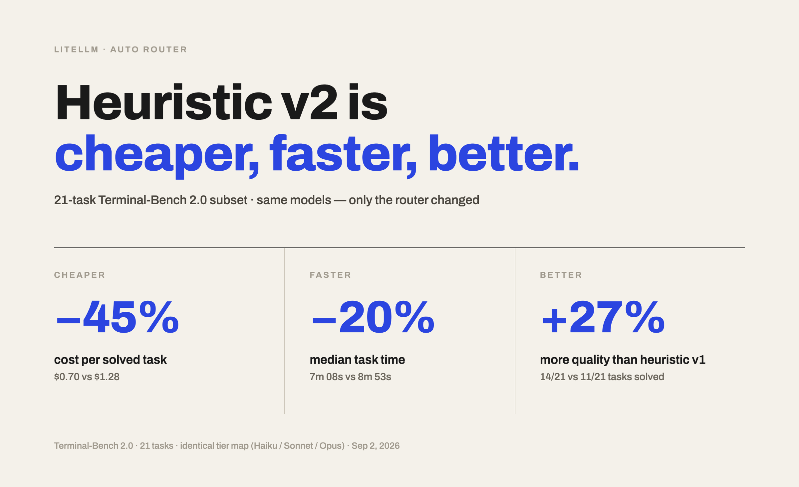

**Heuristic v2, LiteLLM's new AutoRouter classifier, is up to 45% more efficient than Heuristic v1: more tasks solved, at lower cost, in less time.** Only the classifier changed.

{/* truncate */}

:::info[🚀 Help shape the Auto-Router]

Get early access, work directly with the LiteLLM team, and influence the roadmap with your production traffic.

<a className="button button--primary button--lg" style={{background: '#2e8555', borderColor: '#2e8555', color: '#fff'}} href="https://calendar.app.google/i2e7qVEJphHi5S8UA">Apply to Become a Design Partner</a>

<br /><br />

Already testing it? Share your results in [discussion #32168](https://github.com/BerriAI/litellm/discussions/32168).

:::

## Key findings

- **No cold start.** Heuristic v2 ships pretrained across multiple rounds of graded response data, so it already knows which tier to trust before it sees your first prompt
- **3 more tasks solved.** 14/21 against 11/21, a 27% jump in solve rate on this subset
- **45% lower cost per solved task.** $0.70 against $1.28, and 30% lower total spend across the run ($9.78 against $14.06)
- **Faster, too.** Mean LLM call latency fell 10% (13.1s against 14.5s), p90 fell 10% (30.7s against 34.1s), and median task completion time fell from 8m53s to 7m08s
- **Steadier tier choices mean fewer cache misses.** 87% of input tokens were cache reads, against 82% for Heuristic v1
- **Just as reliable.** Zero failed requests in either arm, across 933 combined LLM calls

## What changed

Heuristic v1 scores a prompt's complexity and maps the score to a tier. Heuristic v2 estimates each tier's odds of success on the request and routes to the cheapest tier that clears a probability bar, not the tier that matches a difficulty score.

```text
Prompt
  -> Detect request type and similarity cohort
  -> Estimate success probability for all four tiers
  -> Make probabilities monotonic
  -> Select the first tier with at least 75% predicted success
  -> Route to a model configured in that tier
```

The probability estimate blends three levels of evidence:

- **Tier-wide performance:** how the tier does across all requests
- **Request-type performance:** how it does on this kind of request (code, technical design, analytical reasoning, writing, factual lookup, or general)
- **Similar-request performance:** how it does on requests that look most like this one

Thin evidence defers to the broader estimate; a large sample overrides it. A stronger tier should never look less capable than a weaker one, so the router corrects the four probabilities to be monotonic, then picks the first one that clears the bar:

```text
raw:       [0.60, 0.72, 0.69, 0.91]
corrected: [0.60, 0.72, 0.72, 0.91]
           SIMPLE MEDIUM COMPLEX REASONING
```

Same four abstract tiers as before, `SIMPLE`, `MEDIUM`, `COMPLEX`, `REASONING`. You still decide which models live in each one.

## Pretrained, zero cold start

Adaptive routing earns its edge by watching your traffic: a Thompson-sampled tier pool loses a few rounds on the wrong model before it learns which one wins. Heuristic v2 skips that step. Its success-probability tables are calibrated across multiple rounds of graded response data before the classifier ever ships, so it already knows which tier to trust before it sees your first prompt, no ramp-up period on your traffic required.

## Results

| Classifier | Solve rate | Solved/21 | Total cost | $/solved | Mean call latency | p90 call latency | Median task time |
|---|---:|---:|---:|---:|---:|---:|---:|
| **Heuristic v2** | **66.7%** | **14/21** | **$9.78** | **$0.70** | **13.1s** | **30.7s** | **7m08s** |
| Heuristic v1 | 52.4% | 11/21 | $14.06 | $1.28 | 14.5s | 34.1s | 8m53s |

## Where the savings come from

| Classifier | SIMPLE (Haiku) | MEDIUM (Sonnet) | COMPLEX (Opus) | REASONING (Opus, high effort) |
|---|---:|---:|---:|---:|
| Heuristic v2 | 45% ($1.61) | 55% ($8.17) | 0% | 0% |
| Heuristic v1 | 39% ($1.15) | 45% ($5.18) | 15% ($7.43) | 1% ($0.29) |

Heuristic v2 never escalated to Opus on this benchmark. Heuristic v1 sent 16% of turns to Opus, and those turns made up 55% of its total spend. That escalation didn't buy extra solves this run: the four tasks Heuristic v2 solved that v1 missed (`adaptive-rejection-sampler`, `crack-7z-hash`, `install-windows-3.11`, `password-recovery`) were all solved on Haiku and Sonnet alone. v1 opened one of those four on Opus and still failed it.

Heuristic v1 also switches tiers more often turn to turn, which costs it some prompt-cache hits: 82% of its input tokens were cache reads, against 87% for Heuristic v2.

## Try it

```yaml title="config.yaml"
model_list:
  - model_name: claude-haiku-4-5
    litellm_params:
      model: anthropic/claude-haiku-4-5
      api_key: os.environ/ANTHROPIC_API_KEY
  - model_name: claude-sonnet-5
    litellm_params:
      model: anthropic/claude-sonnet-5
      api_key: os.environ/ANTHROPIC_API_KEY
  - model_name: claude-opus-5
    litellm_params:
      model: anthropic/claude-opus-5
      api_key: os.environ/ANTHROPIC_API_KEY

  - model_name: smart-router
    litellm_params:
      model: auto_router/complexity_router
      complexity_router_config:
        tiers:
          SIMPLE:    claude-haiku-4-5
          MEDIUM:    claude-sonnet-5
          COMPLEX:   claude-opus-5
          REASONING: claude-opus-5
        classifier_type: trained_heuristic
      complexity_router_default_model: claude-sonnet-5
```

:::note Free trial scope

The free trial covers Heuristic v2 on one auto router. If you want it on more than one, [apply to be a design partner](https://calendar.app.google/i2e7qVEJphHi5S8UA) and we'll sort it out with you directly.

:::

Heuristic v2 makes no LLM classifier call on the request path, and reuses the same tier config as Heuristic v1 or the LLM classifier. Swap `classifier_type` and compare against your current setup. Full reference on the [Auto Routing docs page](/docs/proxy/auto_routing).

## How it was measured

- **Benchmark:** a 21-task subset of Terminal-Bench 2.0, both classifiers run concurrently through one LiteLLM proxy, harbor 0.20.0 + terminus-2, `max_turns=50`, `-n 6` per arm, 1 trial per task
- **Tiers:** identical for both arms, SIMPLE to `claude-haiku-4-5`, MEDIUM to `claude-sonnet-5`, COMPLEX and REASONING to `claude-opus-5` at high effort. Only `classifier_type` differs
- **Cost:** total USD across all 21 tasks from gateway spend logs
- **Latency:** per-LLM-call latency measured at the proxy, 437 calls for Heuristic v1 against 496 for Heuristic v2
- **Caveat:** one run per arm on 21 tasks. Heuristic v1 scored 12-13/21 in two earlier runs against 11/21 here, so a few tasks of run-to-run noise is expected and a 3-task gap is suggestive, not conclusive. Total run wall clock ran longer for Heuristic v2 (46m30s against 37m55s, with 6 tasks per arm running concurrently) because of long-running tasks in the tail and one timeout on `chess-best-move`; that's a property of this run's slowest tasks, not a per-request latency regression, which is why the headline numbers above are per-call latency and median task time instead

## Related reading

[Opus-level quality at 27% lower cost](/blog/auto-router-terminal-bench-benchmark), [LiteLLM Fusion: 56% more tasks solved than Fable 5](/blog/fusion-terminal-bench-benchmark), and [what auto-routing saved in production](/blog/auto-router-production-savings).

:::info

Point Heuristic v2 at your own workload and compare it against your current classifier. Share numbers or questions in [discussion #32168](https://github.com/BerriAI/litellm/discussions/32168). To work on this with us directly, [apply to be a design partner](https://calendar.app.google/i2e7qVEJphHi5S8UA).

:::
