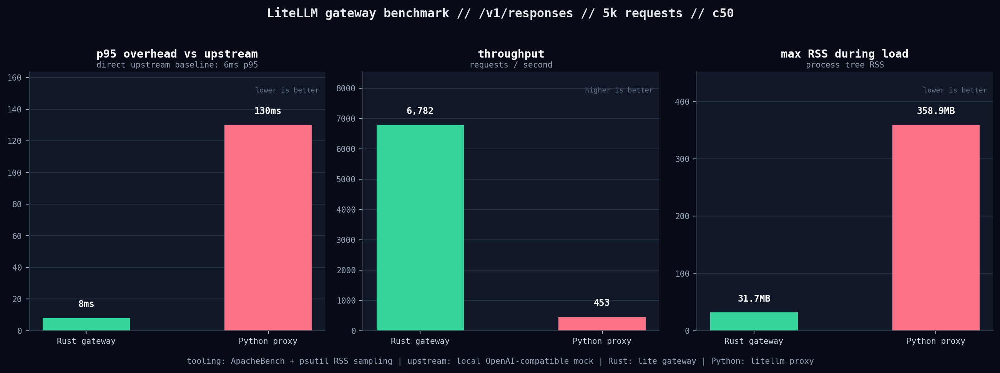

import { DropInMigration, RemoteAgentsFlow, RustMigrationStages, RustServerSteps } from './diagrams';

*Last Updated: June 2026*

## Why is this the right long-term decision for the platform?

LiteLLM is moving the hot path of the AI Gateway to Rust because the gateway is becoming the serving layer for agentic workloads, not just a thin API wrapper. Enterprise AI Gateway deployments now run high-concurrency traffic across `/chat/completions`, `/responses`, and `/messages`; every millisecond of gateway overhead and every extra MB of memory gets multiplied across pods, regions, and retries.

Rust gives us the right long-term platform shape: lower memory utilization, tighter request forwarding overhead, one shared core for the Python SDK and server, and a safer path to high-concurrency streaming. We are not doing this as a rewrite-for-rewrite's-sake project. We are moving the serving core in stages, behind parity tests, and we will not release a Rust path until the relevant end-to-end tests are passing.

{/* truncate */}

## What is changing

We are rebuilding the LiteLLM serving core in Rust so LiteLLM can become the fastest AI Gateway in the world. Rust lets us target the lowest overhead in the industry while keeping the compatibility surface users already depend on.

The end state is simple: a user can deploy a pure Rust server for their AI Gateway endpoints. That gives them the lightest, fastest gateway path: roughly `65MB` of memory instead of roughly `500MB` for a FastAPI-style server, with proxy overhead under `1ms` instead of the higher latency overhead we see from Python under load.

The constraints are just as important as the goal:

- The Python SDK keeps functioning throughout. We cannot risk adoption by forcing a sudden client migration.
- We avoid duplicate implementations. We should not maintain separate Rust and Python versions of the same provider logic.
- Stability wins over speed. We will not sacrifice stability to ship this faster; every release needs the relevant parity and end-to-end tests passing before users get the new path.

<RustMigrationStages />

## The boundary that holds across every stage

The discipline that makes this safe is one boundary: the Rust core describes work, the host executes it.

- **Describe, do not execute.** `litellm-core` is pure. It takes data in and returns data out: transform request, transform response, transform stream chunk, count tokens, normalize errors. It never opens a socket, reads a secret, or touches a database.
- **The host does all I/O.** Python today, Rust later. Same crate, two drivers. This lets us ship Rust to production before a full server rewrite.
- **Stays out of core, always:** network and retries, secret fetching, SDK-based auth signing, routing, caching, database writes, spend writes, and logging callbacks.

## The AI Gateway is becoming the hot path

The Python LiteLLM Gateway remains the production-grade, feature-complete gateway today. It is reliable, broad, and battle-tested across providers. The reason to move the core to Rust is that the traffic pattern has changed.

Agentic systems do not make one LLM call. They make chains of calls, stream intermediate state, retry failures, call tools, and keep sessions alive. That makes the gateway a real data plane. When the gateway sits in front of every request, latency and memory are platform constraints.

The long-term LiteLLM architecture is:

- Python stays as the compatibility layer, SDK surface, and extension point.
- Rust owns the performance-sensitive serving core: request parsing, provider transforms, upstream HTTP, streaming, token/cost accounting, and routing.
- Customer plugins, auth hooks, guardrails, and callbacks continue to work while we move traffic gradually.

<DropInMigration />

## What we measured

We ran a local LLM API proxy benchmark against the same OpenAI-compatible mock upstream. The benchmark compared:

- Direct mock upstream.
- The current LiteLLM Python proxy.
- The Rust LiteLLM gateway.

Traffic shape: `5,000` POST requests, `50` concurrent clients, same `/v1/responses` JSON payload, same local mock upstream, same `Authorization: Bearer sk-bench` auth header. Load generator: ApacheBench. RSS sampler: `psutil` over the full gateway process tree. The summarized CSV is checked into this post folder as [`rust_proxy_benchmark_results.csv`](./rust_proxy_benchmark_results.csv).



In our local tests at `5,000` requests and `50` concurrent clients, the Rust gateway added `8ms` p95 proxy overhead over the direct upstream baseline, peaked at `31.7MB` RSS during load, and served `6,782` requests/second. The Python proxy added `130ms` p95 proxy overhead, peaked at `358.9MB` RSS during load, and served `453` requests/second.

This is not a provider benchmark and it is not a full production benchmark. It is a narrow proxy-forwarding measurement for the LLM API data plane: auth, request forwarding, response handling, and local upstream I/O. That is the layer we are moving first.

## The migration dates

We are going to do this in a stable way. Each milestone ships behind parity coverage, and the release gate is simple: the relevant unit, provider, streaming, and end-to-end tests must pass before users get the new path.

| Date | What users get | Release gate |
|---|---|---|
| **August 15, 2026** | First Rust server for `/ocr` across providers. This is the lower-risk route that proves server packaging, provider parity, auth shape, and rollout mechanics before the larger endpoints move. | OCR provider parity, server smoke tests, auth checks, and e2e tests for the `/ocr` route. |
| **September 1, 2026** | Python SDK backed by Rust bindings. Core providers for `/chat/completions`, `/responses`, and `/messages` run through the Rust core. | Provider parity tests, streaming parity tests, SDK e2e tests, and no regression in the existing Python SDK contract. |
| **September 15, 2026** | Router moved to Rust for routing, retries, fallbacks, cooldowns, and high-concurrency request selection. | Router e2e coverage passing across fallback, retry, cooldown, budget, and streaming cases. |
| **December 1, 2026** | Rust gateway for `/chat/completions`, `/responses`, and `/messages` with auth. | Full gateway e2e suite passing before release, including auth, provider transforms, streaming, error mapping, and compatibility checks. |

The important part is not the calendar alone. The important part is the shape of the rollout: Python SDK first, then router, then gateway. That lets us prove the Rust core in production paths before the full server cutover.

## Stage 2 to Stage 3: onto a server

By the end of Stage 1, the Python hot path is: receive request, run auth and rate limits, hand to Rust for transform plus HTTP plus stream plus cost, then return to Python for callbacks and spend. Stage 2 empties the Python hot path of forwarding logic. Stage 3 removes Python from the hot path entirely.

<RustServerSteps />

There are two steps to a pure Rust server:

- **V5a: FastAPI as a thin shell.** FastAPI still terminates HTTP and runs auth, rate limiting, and callbacks, but the entire forwarding path is one PyO3 call into Rust.
- **V5b: pure Rust server.** A native server consumes the same `litellm-core` and `litellm-router` crates with no PyO3 on the hot path. Customer Python plugins can run in an optional sidecar so the migration stays non-breaking.

## Why this ordering de-risks the migration

- **V0 retires integration risk** at the smallest surface: `/ocr`, PyO3, packaging, server boot, and parity.
- **V1 retires streaming risk** before the largest parameter matrix.
- **V2 takes the largest endpoint** only after the loop is proven.
- **V3 captures most traffic.** V4 then empties the Python hot path; V5 is mostly server plumbing because core, providers, and router are already exercised.

Every version ships to real users before the next begins, with the conformance harness as the release gate.

## The fastest Rust workflow we can ship

The fastest useful workflow is a Rust gateway calling a Rust serving frontend for local inference:

```txt
Client
  -> LiteLLM Rust Gateway
  -> OpenAI-compatible local inference endpoint
  -> vLLM Metal Rust frontend
  -> vLLM engine
```

vLLM Metal now documents an experimental Rust frontend that can replace the Python serving layer for `vllm serve`, enabled with:

```bash
VLLM_USE_RUST_FRONTEND=1 \
  VLLM_RUST_FRONTEND_PATH="$HOME/.cargo/bin/vllm-rs" \
  vllm serve Qwen/Qwen3-0.6B
```

Then LiteLLM can route to the local OpenAI-compatible endpoint:

```yaml
model_list:
  - model_name: local/qwen
    litellm_params:
      model: openai/local/qwen
      api_base: http://127.0.0.1:8000/v1
      api_key: os.environ/LOCAL_INFERENCE_API_KEY
```

This gives us one Rust-first workflow quickly: Rust gateway, Rust request serving frontend, OpenAI-compatible inference API. We should be precise about what this means: vLLM's Rust frontend replaces the Python serving layer, while the underlying engine boundary still belongs to vLLM. That is enough for the first workflow because the LiteLLM data plane and inference API frontend are the parts that sit on every request.

## Built for autonomous agents

The Rust gateway work also lines up with where LiteLLM is going for coding agents and long-running AI workflows. A reliable AI Gateway needs more than fast forwarding. It needs to schedule, sandbox, persist state, and stream results without turning the gateway into a memory-heavy bottleneck.

<RemoteAgentsFlow />

The Rust data plane gives us a better base for this: lower per-process memory, better concurrency, and a smaller runtime for the path that every agent request crosses.

## Key Takeaways

- LiteLLM is moving the AI Gateway hot path to Rust because gateway overhead and memory now compound across agentic workloads.
- In our local `/v1/responses` proxy benchmark at `50` concurrent clients, Rust added `8ms` p95 overhead, served `6,782` requests/second, and peaked at `31.7MB` RSS.
- The migration is staged: `/ocr` Rust server by August 15, Rust-backed Python SDK by September 1, Rust router by September 15, Rust gateway with auth by December 1.
- Every milestone is gated on parity and end-to-end tests passing before release.
- Python remains the compatibility layer while Rust becomes the serving core.

---

## Frequently Asked Questions

### Is LiteLLM replacing the Python SDK?

No. The Python SDK stays. The September 1 milestone makes the Python SDK call into Rust bindings for the core provider paths, so users keep the same Python interface while the data plane moves underneath it.

### Will the Rust gateway be a breaking change?

The December 1 gateway target is designed as a compatible path for `/chat/completions`, `/responses`, and `/messages` with auth. The release gate is end-to-end compatibility, not just a server that boots.

### What happens to custom auth, callbacks, and plugins?

They stay on the compatibility path while the core serving path moves to Rust. Where customer Python code is required, Python remains available as an extension layer rather than being forced into the hot forwarding path.

### Is this available in LiteLLM OSS?

The Rust migration is being built for LiteLLM OSS. [LiteLLM Enterprise](https://litellm.ai/enterprise) adds SSO/SCIM, air-gapped deployment, 24/7 SLA support, and advanced guardrails on top for regulated production environments.

---

## Conclusion

Rust is the right long-term decision for LiteLLM because the AI Gateway is now core serving infrastructure. The right failure mode is not a rushed rewrite; it is a staged migration where each provider path, router path, and gateway path earns release through passing tests and measured performance.

This is how AI Gateway infrastructure should evolve under pressure: keep the compatibility users rely on, move the high-concurrency path to the right runtime, and release only when the test suite says it is ready.

## Recommended Reading

- [LiteLLM AI Gateway - full feature overview](https://docs.litellm.ai/docs/simple_proxy)
- [Load balancing and routing across 100+ LLM providers](https://docs.litellm.ai/docs/routing)
- [vLLM Metal Rust frontend](https://docs.vllm.ai/projects/vllm-metal/en/latest/rust_frontend/)
