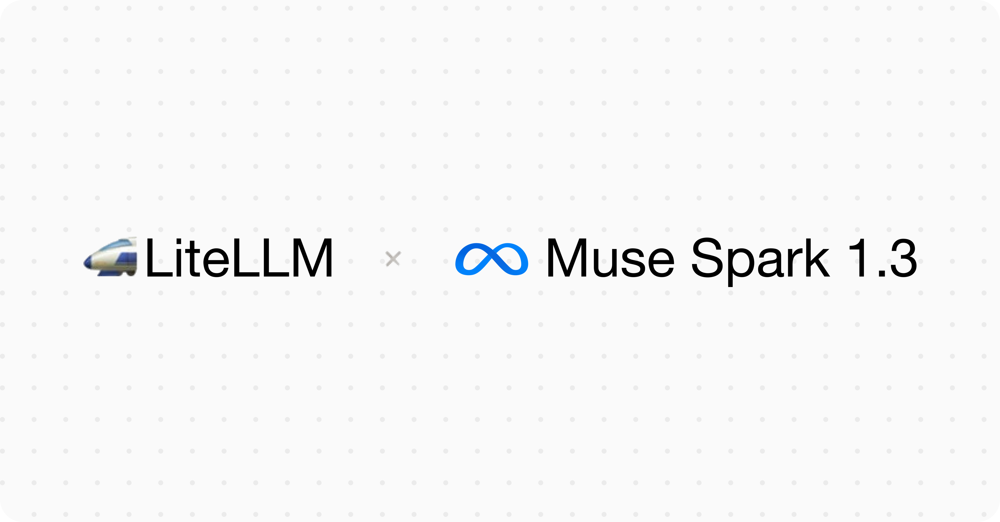

import Tabs from '@theme/Tabs';
import TabItem from '@theme/TabItem';



# Muse Spark 1.3 day 0 support

LiteLLM now offers `muse-spark-1.3` and `muse-spark-1.3-contributor` on day 0, through the `meta/` route on the Meta Model API. Meta ships 1.3 today in Muse Code and the Model API, tuned for long-horizon agentic and coding work, and reports roughly 20% fewer tool calls and 25% fewer tokens than 1.2 internally.

{/* truncate */}

## Pricing

Standard pricing is unchanged from 1.2.

| Per 1M tokens | Standard | Contributor |
|---|---|---|
| Input | $1.25 | $0.10 |
| Output | $4.25 | $0.20 |
| Cached input | $0.15 | $0.002 |

The contributor tier runs 12.5x cheaper on input and 21x cheaper on output, with no end date attached. Rate limits differ as well, 100 RPM on contributor against 3,000 RPM on standard, enforced per team rather than per key. Web search grounding bills $2.50 per 1,000 queries on both.

## Quick Start

<Tabs>
<TabItem value="sdk" label="SDK">

```python
from litellm import completion

response = completion(
    model="meta/muse-spark-1.3",
    messages=[{"role": "user", "content": "Summarize this article in 3 bullet points."}],
)

print(response.choices[0].message.content)
```

</TabItem>

<TabItem value="proxy" label="PROXY">

**1. Setup config.yaml**

```yaml
model_list:
  - model_name: muse-spark-1.3
    litellm_params:
      model: meta/muse-spark-1.3
      api_key: os.environ/META_API_KEY

  # Cheaper tier, but Meta may train on your prompts and completions
  - model_name: muse-spark-1.3-contributor
    litellm_params:
      model: meta/muse-spark-1.3-contributor
      api_key: os.environ/META_API_KEY
```

**2. Start proxy**

```bash
litellm --config /path/to/config.yaml
```

**3. Make requests**

```bash
curl -X POST http://localhost:4000/v1/chat/completions \
  -H "Content-Type: application/json" \
  -H "Authorization: Bearer <YOUR-LITELLM-KEY>" \
  -d '{
    "model": "muse-spark-1.3",
    "messages": [{"role": "user", "content": "Hello!"}]
  }'
```

</TabItem>
</Tabs>

## Reasoning, modalities, and audio

Muse Spark 1.3 is a reasoning model. LiteLLM passes `reasoning_effort` through in OpenAI shape, accepting `minimal`, `low`, `medium`, `high`, and `xhigh`. Meta's announcement names a higher "max reasoning" mode that is not available yet, so `xhigh` is the ceiling today. Reasoning tokens bill as output tokens.

Text, image, video, and PDF input work as they did on 1.2, across `/v1/chat/completions`, `/v1/responses`, and [`/v1/messages`](../../docs/anthropic_unified), with a 1,048,576-token context window.

## Feedback

Running Muse Spark 1.3 through LiteLLM and hitting something unexpected? Share it in [GitHub discussions](https://github.com/BerriAI/litellm/discussions/39439).
