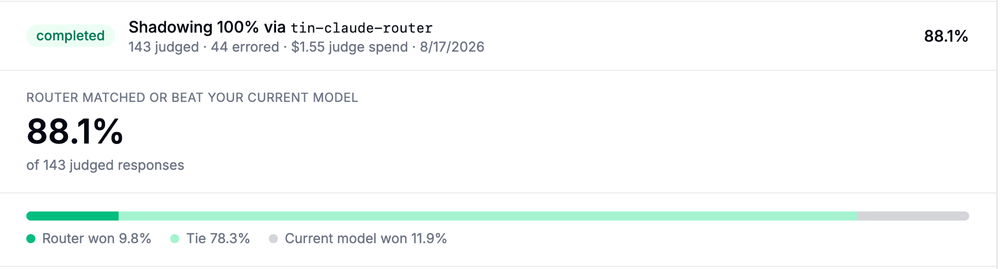

import NavigationCards from '@site/src/components/NavigationCards';

Every post ran against a live LiteLLM proxy with real provider APIs and publishes the config it used. Numbers below are quoted from the posts.

## Terminal-Bench 2.0: Opus-level quality at 27% lower cost

- **16/21 solved** by the router and by Claude Opus-5 alone. Same solve rate.
- **$14.34 vs $19.74** total cost. 27% lower.
- Classifier: gpt-5.4-mini reading only the current message.
- Widening context to the last 3 user messages: solve rate 66.7% to 76.2%, cost +44%.
- Adding assistant replies to the classifier's view: quality down, cost up. The shipped default keeps them out.

<NavigationCards
columns={2}
items={[
  {
    title: "Auto Router: Opus level quality at up to 27% lower cost",
    description: "Full results by context window, the router versus each single model, and the exact config.",
    to: "/blog/auto-router-terminal-bench-benchmark",
  },
  {
    title: "Introducing LiteLLM Fusion: 56% More Tasks Solved Than Fable 5",
    description: "Same 21 tasks, three models in parallel plus one synthesizer: +36% spend, 12% less per solved task, 5x turn latency.",
    to: "/blog/fusion-terminal-bench-benchmark",
  },
]}
/>

## Heuristic v2: 27% more tasks solved at 45% lower cost per task

| Classifier | Solve rate | Solved/21 | Total cost | $/solved | Mean call latency | p90 call latency | Median task time |
|---|---:|---:|---:|---:|---:|---:|---:|
| **Heuristic v2** | **66.7%** | **14/21** | **$9.78** | **$0.70** | **13.1s** | **30.7s** | **7m08s** |
| Heuristic v1 | 52.4% | 11/21 | $14.06 | $1.28 | 14.5s | 34.1s | 8m53s |

- Same 21-task Terminal-Bench 2.0 subset, identical tiers, only `classifier_type` differs.
- **No LLM classifier call** on the request path. Pretrained on graded response data, so no cold start.
- **87%** of input tokens were cache reads, against 82% for v1: steadier tier choices mean fewer cache misses.
- Zero failed requests in either arm across 933 LLM calls.
- Enable with `classifier_type: trained_heuristic`.

<NavigationCards
columns={2}
items={[
  {
    title: "Introducing AutoRouter Heuristic v2: 27% More Tasks Solved at 45% Lower Cost",
    description: "What changed in the classifier, per-tier results, latency, and the free trial scope.",
    to: "/blog/heuristic-v2",
  },
]}
/>

## Six public benchmarks and RouterArena: 40% to 75% cheaper

| Evaluation | Sample | Cost vs all-Opus-5 | Quality vs frontier |
| --- | --- | --- | --- |
| Six public benchmarks, live proxy | 220 graded prompts | 40.4% cheaper | 97.1% (91.8% vs 94.5% pass) |
| RouterArena | 8,399 queries | 74.5% cheaper | 87.3% |
| WildChat-1M simulation | 12,000 conversations | 64.9% cheaper | not measured |
| DevGPT simulation | 2,056 conversations | 65.4% cheaper | not measured |
| Code-filtered WildChat | 993 conversations | 20.0% cheaper | not measured |

<NavigationCards
columns={2}
items={[
  {
    title: "Cut 75% Claude Code cost with near frontier model quality",
    description: "Per-benchmark grades, the conversation simulations, and where the savings come from.",
    to: "/blog/auto-router-cost-quality-benchmark",
  },
]}
/>

## Classifier context: 14% to 78% agreement on follow-ups

- **5,600 live classifier calls.**
- Agreement on follow-ups that only resolve against history: **14% at 0 turns, 47% at 1, 78% at 2**, flat out to 10.
- Classifier cost: **at most $0.61 per 1,000 requests**.
- Latency deltas versus no context: every 95% interval contains zero.
- Shipped default: 3 prior user turns, 200 characters each, no assistant turns.

<NavigationCards
columns={2}
items={[
  {
    title: "Auto Router v1.97: usage benchmarks and better quality for lower cost",
    description: "Agreement versus window size, classifier cost per request, latency deltas, and the Benchmarks view.",
    to: "/blog/auto-router-context-and-benchmarks",
  },
]}
/>

## Production: 51% saved across 272,876 requests

- **450+ users**, dev, staging, and production, 2026-04-15 to 2026-08-09.
- **272,876 requests, 7.08B tokens.**
- **$11,736 spent vs $23,985** flagship-only counterfactual: **$12,249 saved, 51.1%**.
- Savings rate rose from 42.9% in the first full month to 60.7% in the last as the tier map was tuned.
- 95% of requests never reached the flagship tier.

<NavigationCards
columns={2}
items={[
  {
    title: "51% Cost Savings Reported From a Live Production Deployment",
    description: "Month-by-month savings, tier distribution, the config they ran, and what they changed.",
    to: "/blog/auto-router-production-savings",
  },
]}
/>

## Shadow evaluation: 88.1% matched or beat the current model

- Blind LLM judge on our own live gateway traffic, before any user-facing response changed.
- **143 judged turns, $1.55 judge spend.**
- Router won 9.8%, tie 78.3%, current model won 11.9%.
- How to run one on your traffic: [Evaluate on Your Traffic](/docs/auto_router/evaluate).

<NavigationCards
columns={2}
items={[
  {
    title: "Shadow Evaluations: Test the Auto-Router on Your Own Production Traffic",
    description: "Sampling, duplication, blind judging, and the results card.",
    to: "/blog/auto-router-shadow-evaluations",
  },
]}
/>

## Prompt caching: 37% to 69% cheaper than caching alone

- Five datasets, including live gateway traffic with the provider's own cache accounting.
- Router plus caching beat caching one fixed model on every dataset.
- Full treatment: [Prompt Caching](/docs/auto_router/prompt_caching).
